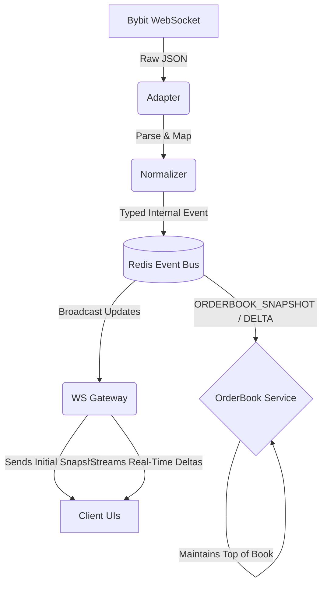

# Market Data System 

Built a streaming market data pipeline from scratch, piece by piece.

## What We Accomplished

1. **Adapter**: Connected directly to Bybit's V5 linear websocket, handling heartbeats and subscriptions to the 50-level order book.
2. **Normalizer**: Used `zod` to validate Bybit's heavily minified JSON (turning `s`, `b`, `a` into a safe `OrderBookEvent`), preventing bad data from crashing our server.
3. **Event Bus**: Set up `ioredis` to decouple our ingestion pipeline from our serving layer. This means you could theoretically run 10 instances of the WS Gateway on different servers and they would all stay in sync!
4. **OrderBook Service**: Built a state machine that stores order book levels in Maps, clearing on snapshots and smartly updating/deleting on deltas. It can also format the book correctly (sorted bids descending, asks ascending).
5. **Gateway**: Exposed our clean, normalized, real-time data to clients via a local WebSocket server.

> [!TIP]
> **Possible Steps**: In order to expand this project, we could add a completely new `BinanceAdapter.ts` and `BinanceNormalizer.ts`. Because of the Event Bus, we wouldn't have to touch the `OrderBookService` or `WsGateway` at all!
